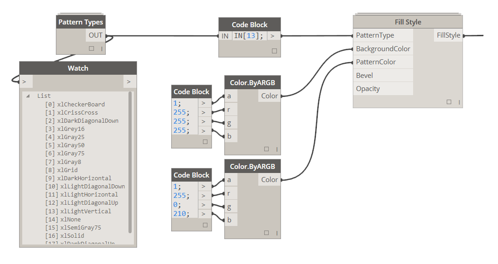

### 2.1.0 Define Fill Style

<blockquote>

<b> PatternType:</b> [Pattern Type] If you wish to apply fill pattern to a cell use this input to specify it.

<b> BackgroundColor:</b> [Color] If you wish to specify a background color in a cell use Color.ByARGB node to do so.

<b> PatternColor:</b> [Color] If you wish to specify pattern color use Color.ByARGB node to do so.

<strikethrough><b> Bevel:</b> [Bevel Type] Currently unavailable </strikethrough>

<b> Opacity:</b> [Integer] Currently unavailable 

</blockquote>

&nbsp;
<blockquote>

<b>Tip:</b> When defining Pattern Color one has to specify a background color. Pattern color will only "take" when Background is defined. I usually define background to be White. 
</blockquote>