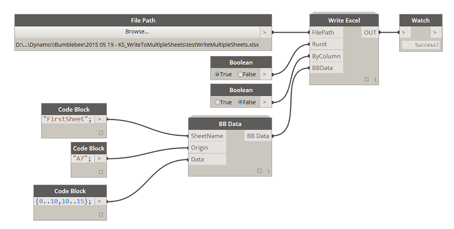

# 2.1.0 Write Data to Excel

### 2.1.1 Write a Single Column or Row of Data to Excel

### 2.1.2 Write Multiple Columns of Data to Excel

This is probably the most common application for Bumblebee - writing a nested list of data to multiple columns or rows to an Excel spreadsheet. Here's how its done: 

**File Path:** [FilePath] If file path does not exist, please navigate to directory that you wish to create a new file in and instead of selecting it just type in its name and Excel file extension *.xlsx

**RunIt:** [Boolean] If set to False it will disable this node. If set to True it will enable this node and execute the write process. 

**ByColumn:** [Boolean] If set to False this file will be written "By Row" which is a standard Excel writing method. Setting it to True will be equivelant to performing a Transpose function on data before writing it. 

**BBData:** [BBData] This is a BBData input. Please see below for how this node can be set up. 

####Setting Up BB Data Node:

