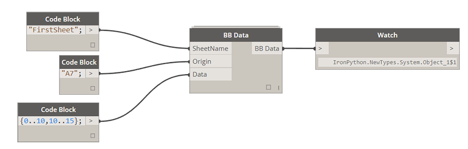

# 2.1.0 Write Data to Excel

### 2.1.2 Write Multiple Rows of Data to Excel

This is probably the most common application for Bumblebee - writing a nested list of data to multiple columns or rows to an Excel spreadsheet. Here's how its done: 

**File Path:** [FilePath] If file path does not exist, please navigate to directory that you wish to create a new file in and instead of selecting it just type in its name and Excel file extension *.xlsx

**RunIt:** [Boolean] If set to False it will disable this node. If set to True it will enable this node and execute the write process. 

**ByColumn:** [Boolean] If set to False this file will be written "By Row" which is a standard Excel writing method. Setting it to True will be equivelant to performing a Transpose function on data before writing it. 

**BBData:** [BBData] This is a BBData input. Please see below for how this node can be set up. 

####Setting Up BB Data Node:

For any of the inputs please make sure that you always match their data types. What I mean by that is if you define SheetName to be a list of two items: ["Sheet1","Sheet2"] then make sure that Origin is also a matching list: ["A1","A1"] and Data is a Nested List of Lists: [[[1,2],[1,2]],[[2,2],[2,2]]]. 

**SheetName:** [String or List[String]] If Sheet Name is a single item, Origin and Data input have to match that. This is a Sheet that Data will be written into. If sheet with specified name doesn't exist a new sheet with that name will be added to specified Excel document.

**Origin:** [String or List[String]] This is origin cell that data writing will start at. By default this input is specified at A1 but it can be changed to begin writing from any other location.

**Data:** [List[] or Nested List[[]]] This is data that you wish to write to Excel. For now Bumblebee was only tested writing Numbers and Strings. 

