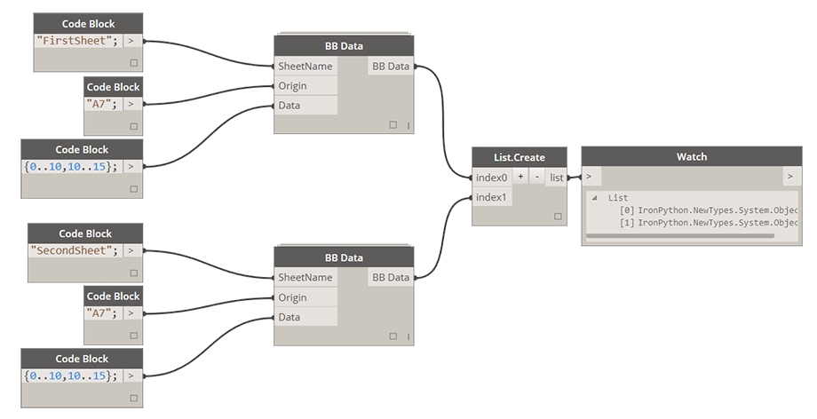
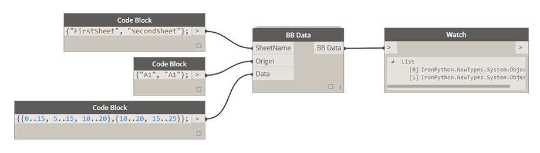
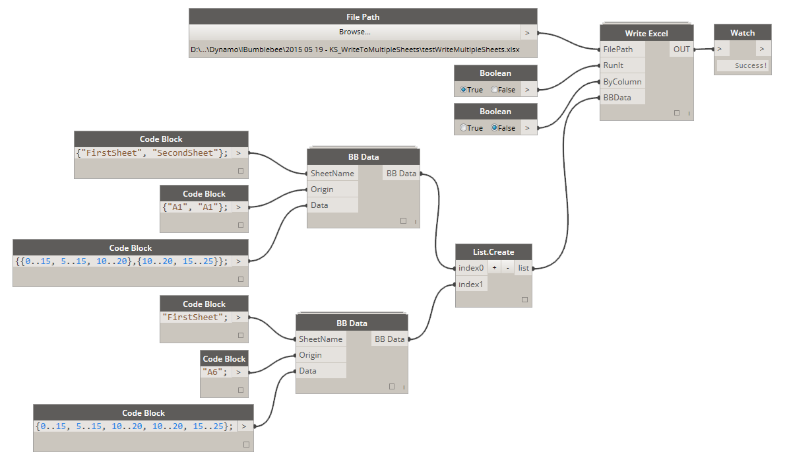

# 1.2.0 Write Data to Excel

### 1.2.1 Write Multiple Rows of Data to Excel

This is probably the most common application for Bumblebee - writing a nested list of data to multiple columns or rows to an Excel spreadsheet. Here's how its done: 

<blockquote>

<b> File Path:</b> [FilePath] If file path does not exist, please navigate to directory that you wish to create a new file in and instead of selecting it just type in its name and Excel file extension *.xlsx 

<b>RunIt:</b> [Boolean] If set to False it will disable this node. If set to True it will enable this node and execute the write process.

<b>ByColumn:</b> [Boolean] If set to False this file will be written "By Row" which is a standard Excel writing method. Setting it to True will be equivelant to performing a Transpose function on data before writing it.

<b>BBData:</b> [BBData] This is a BBData input. Please see below for how this node can be set up.

</blockquote>

### 1.2.2 Setting Up BB Data Node

For any of the inputs please make sure that you always match their data types. What I mean by that is if you define SheetName to be a list of two items: ["Sheet1","Sheet2"] then make sure that Origin is also a matching list: ["A1","A1"] and Data is a Nested List of Lists: [[[1,2],[1,2]],[[2,2],[2,2]]]. 

<blockquote>

<b>SheetName:</b> [String or List[String]] If Sheet Name is a single item, Origin and Data input have to match that. This is a Sheet that Data will be written into. If sheet with specified name doesn't exist a new sheet with that name will be added to specified Excel document.

<b>Origin:</b> [String or List[String]] This is origin cell that data writing will start at. By default this input is specified at A1 but it can be changed to begin writing from any other location.

<b>Data:</b> [List[] or Nested List[[]]] This is data that you wish to write to Excel. For now Bumblebee was only tested writing Numbers and Strings. 

</blockquote>

### 1.2.3 Combining BB Data Nodes to Write Multiple Sheets

Bumblebee has ability to write more than one sheet at the time. You can generate a single BB Data node for each sheet and then use List.Create to combine them into a list of BB Data objects that can be used as an input to Write Excel node. 

You can also achieve this functionality using a single BB Data node like so: 

### 1.2.4 Additional Example

You can also combine BB Data nodes in this fashion to write not only to multiple sheets but also to the same sheet but from a different origin. 

