# 2.2.0 Read Data from Excel

### 2.2.1 Read Single Sheet - Entire Content

You can read Excel files in a number of different ways using Bumblebee. You can read an entire sheet contents, read from specified origin point, read only a specific range of data or do all of the former but for multiple sheets.

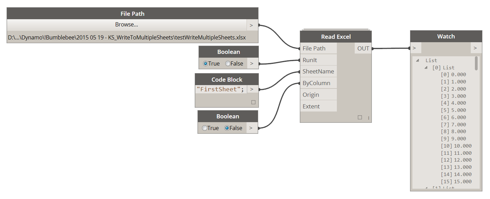

<blockquote>

<b> FilePath:</b> [FilePath] Use FilePath node to point at Excel file that you wish to read data from. 

<b> RunIt:</b> [Boolean] Set this to True to enable this node and read data from file. Set this to False to disable this node. 

<b> SheetName:</b> [String or List[String]] Set this input to a single sheet name or use a list of sheet names to read multiple sheets.

<b> ByColumn:</b> [Boolean] Set this input to True to read excel data "by column" instead of default excel behavior "by row" 

<b> Origin:</b> [String or List[String]] Leave this input blank and default origin is set to start at A1. You can either supply an excel address format: "A1" or a cell index format List[1,1] to set the origin cell from which data will be read 

<b> Extent:</b> [String or List[String]] Leave this input blank and default extent is set to read the whole sheet. You can either supply an excel address format: "A13" or a cell index format List[1,13] to constrain the extent of document that you want to read.

</blockquote>

### 2.2.2 Read Single Sheet - From Specific Origin

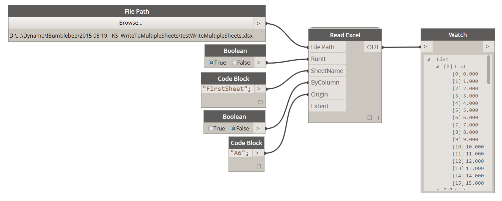

In this example we are setting the Origin to be at A6 so data will only be read from that point out since Extent was unspecified. 

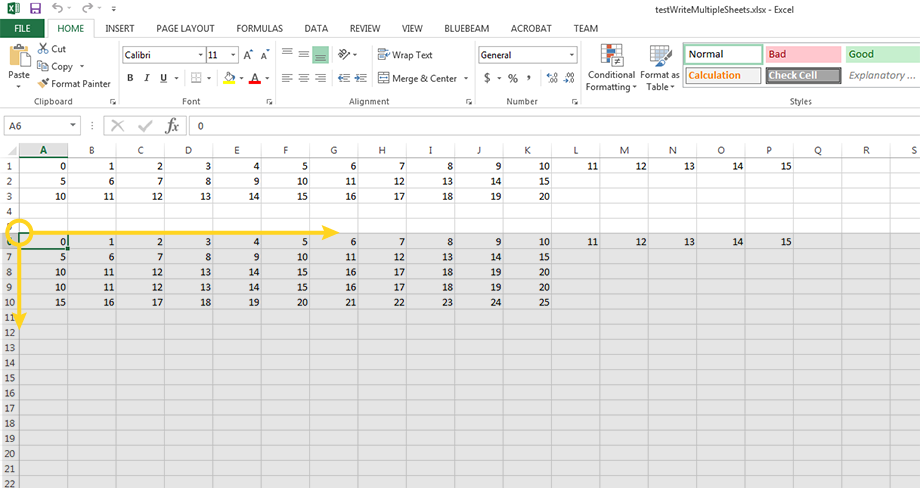

### 2.2.3 Read Single Sheet - Specific Range Only

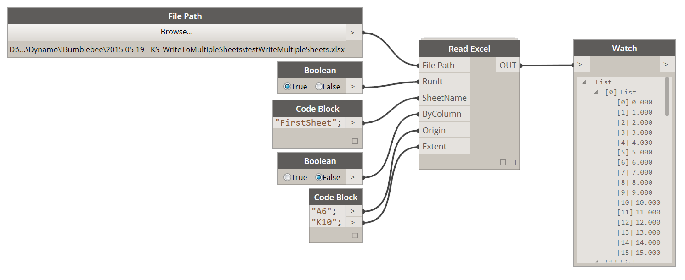

In this example we are setting both the Origin and Extent effectively creating a Range of data that we want to read.

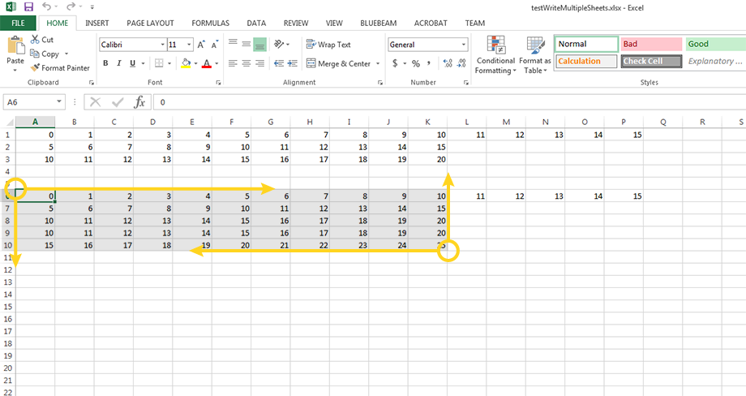

### 2.2.4 Read Single Sheet - From Specific Extent

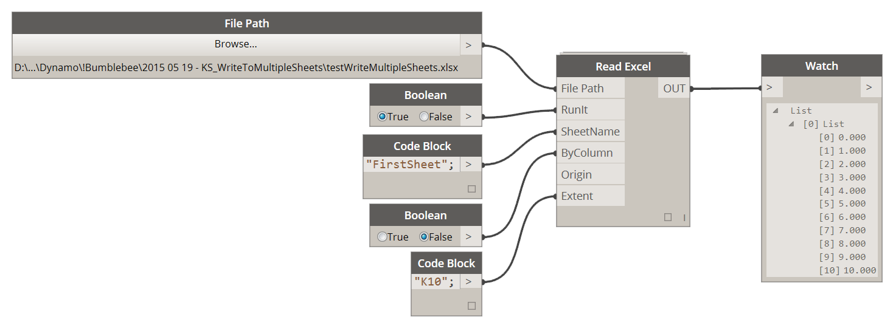

In this example we are setting the Extent only effectively creating a range that starts at the origin of the document: A1 and extends to our specified extent input. 

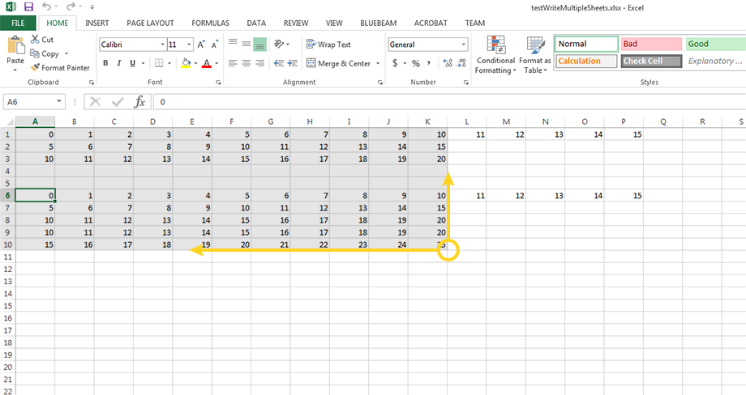

### 2.2.5 Read Multiple Sheets - Entire Content

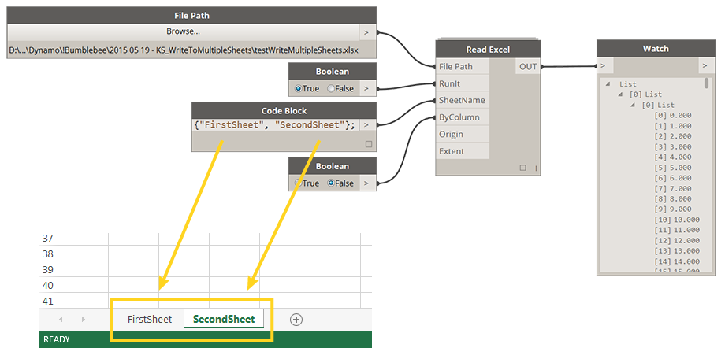

<blockquote>

<b>Tip:</b> You can create the list of sheet names in veriaty of ways. I personally prefer Code Blocks but its not a must and other ways will work just fine. Here's another one:

</blockquote>

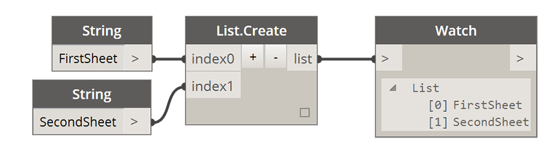

### 2.2.6 Read Multiple Sheets - From Specific Origin

Please make sure that if you are specifying multiple sheet names (List[]) and multiple origins/extents to match their lengths. For example if I have a List["FirstSheet","SecondSheet"] and you want to specify a different origin for each sheet to do it like so: List["A1","B1"]. You can of course leave the origin/extent inputs blank and defaults discussed earlier will apply. Here's an example:

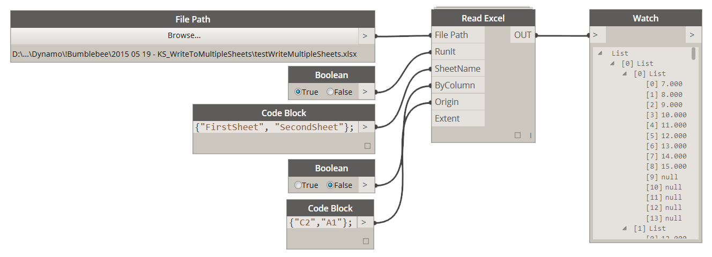

<blockquote>

<b>Tip:</b> As you can see in the image above there is bunch of elements returned that are "Null". This is perfectly normal as all empty cells will return a Null value. You can remove all Null values using a seperate utility (Clear List) that can be found in Archi-lab (Grimshaw) Package. Please see below: 

</blockquote>

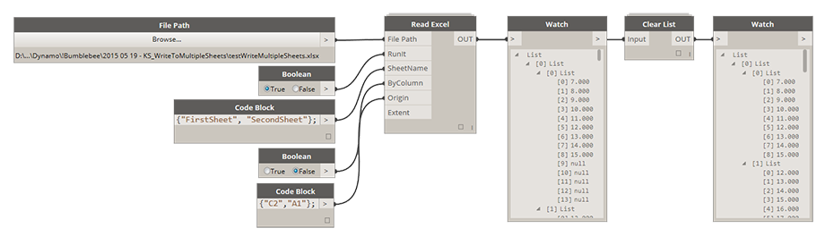

<blockquote>

<b>Tip:</b> You can use a Cell Index node which is also part of Bumblebee package to convert an excel address from string format "A1" to index format [1,1] 

</blockquote>

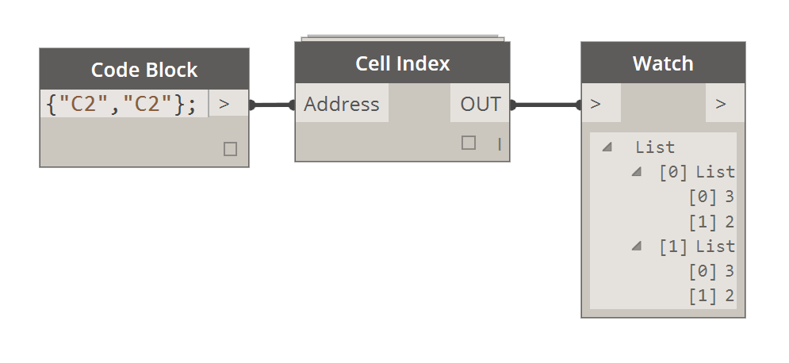

<blockquote>

<b>Tip:</b> While reading multiple sheets from an Excel file it might be a time saver to be able to query up all sheet names that file contains without having to open it first. Please use Get Worksheet Names node to do just that, but <b>DO NOT</b> use its output to set up Read Excel node as it will cause a conflict. 

</blockquote>

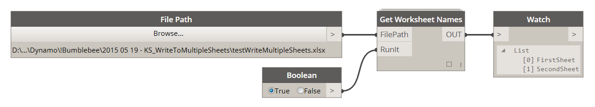

