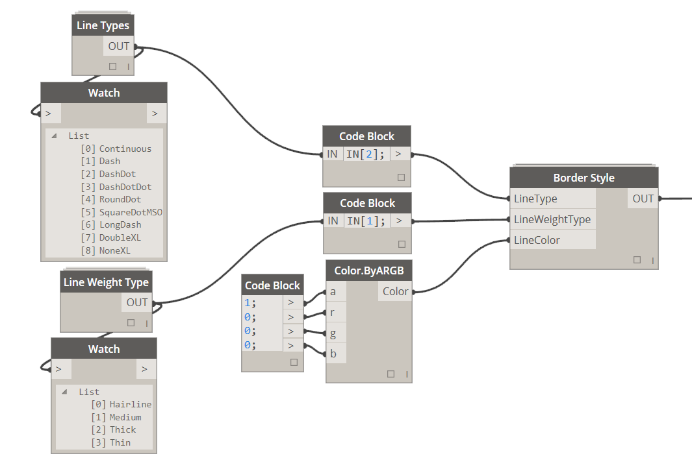

### 2.3.0 Define Border Style

<blockquote>

<b> LineType:</b> [Line Type] If you wish to define a line type different than a solid use this input to do so.

<b> LineWeightType:</b> [Line Weight Type] Line weights can only be one of the following types: Hairline, Medium, Thick or Think.

<b> LineColor:</b> [Color] If you wish to specify line color use Color.ByARGB node to do so.

</blockquote>