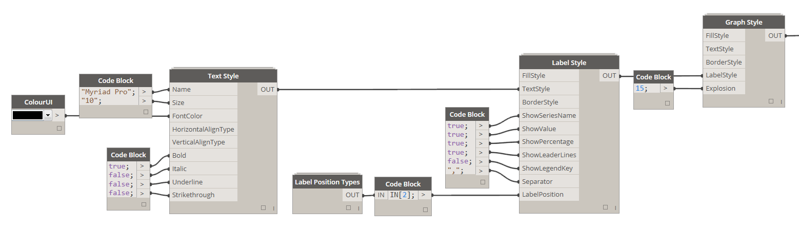
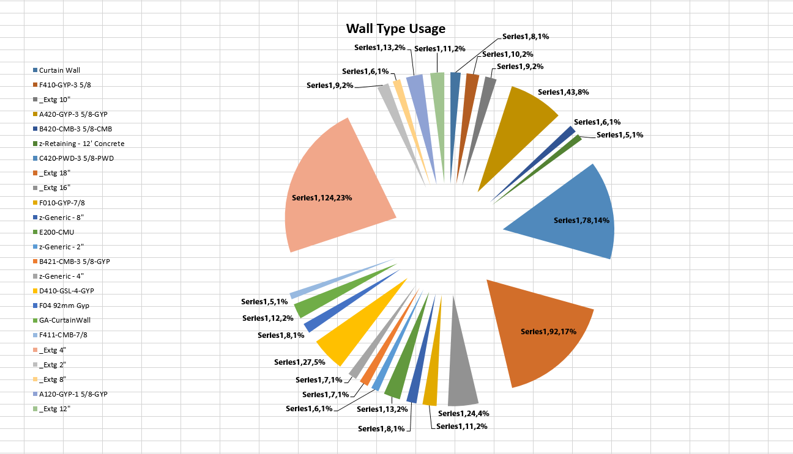

### 2.5.0 Define Graph Style

<blockquote>

<b> FillStyle:</b> [Fill Style] <a href="http://konradsobon.gitbooks.io/bumblebee-primer/content/210_fill_style.html">See Fill Style section for more details.</a>

<b> TextStyle:</b> [Text Style] <a href="http://konradsobon.gitbooks.io/bumblebee-primer/content/220_text_style.html">See Text Style section for more details.</a>

<b> BorderStyle:</b> [Border Style] <a href="http://konradsobon.gitbooks.io/bumblebee-primer/content/230_border_style.html">See Border Style section for more details.</a>

<b> LabelStyle:</b> [Label Style] <a href="http://konradsobon.gitbooks.io/bumblebee-primer/content/260_label_style.html">See Label Style section for more details.</a>

<b> Explosion:</b> [Integer] Use this input to set the amount of explosion that will be added to Pie Chart. 

</blockquote>

#### 2.5.1 Example of a chart with labels and large amount of explosion:

