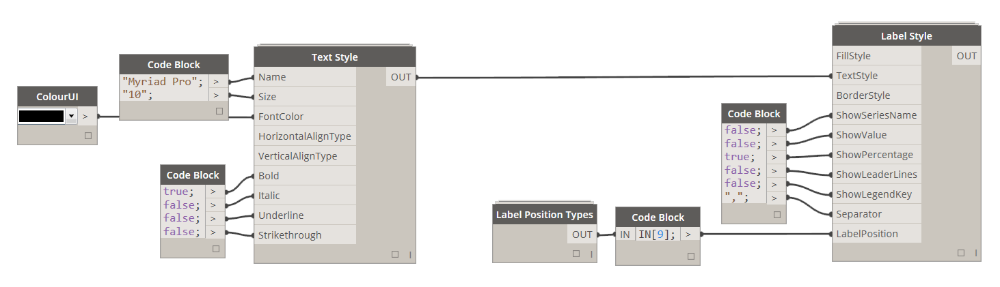
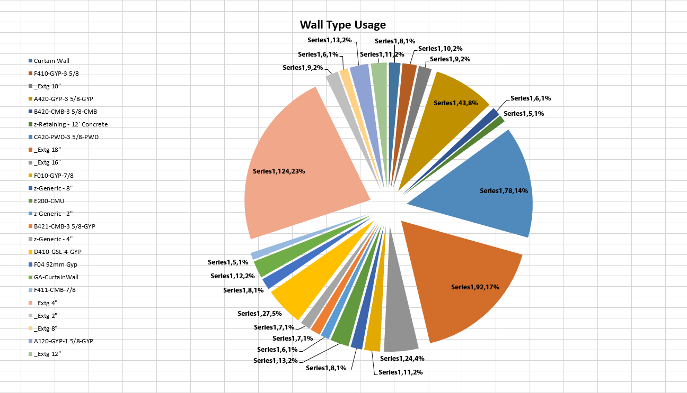

### 2.6.0 Define Label Style

<blockquote>

<b> FillStyle:</b> [Fill Style] <a href="http://konradsobon.gitbooks.io/bumblebee-primer/content/210_fill_style.html">See Fill Style section for more details.</a>

<b> TextStyle:</b> [Text Style] <a href="http://konradsobon.gitbooks.io/bumblebee-primer/content/220_text_style.html">See Text Style section for more details.</a>

<b> BorderStyle:</b> [Border Style] <a href="http://konradsobon.gitbooks.io/bumblebee-primer/content/230_border_style.html">See Border Style section for more details.</a>

<b> ShowSeriesName:</b> [Boolean] If set to True a label text will include data Series Name.

<b> ShowValue:</b> [Boolean] If set to True a label text will include a value from data range that corresponds to this data point.

<b> ShowPercentage:</b> [Boolean] If set to True a label text will include a percentage that this data point is in relation to the whole data set.

<b> ShowLeaderLines:</b> [Boolean] If set to True and Label Position is set to Best Fit, for labels that were seperated from the data point, there will be a leader line.

<b> ShowLegendKey:</b> [Boolean] If set to True a label will include a Legend Key next to label text.

<b> Separator:</b> [String] A string that will be used to separate each value in the label if more than one value is displayed. For example: SeriesName, Percentage, Value etc.

<b> LabelPosition:</b> [Label Position Type] Use Label Position Types to define a location for labels.

</blockquote>

#### 2.6.1 Example of a chart with labels set to Best Fit:

