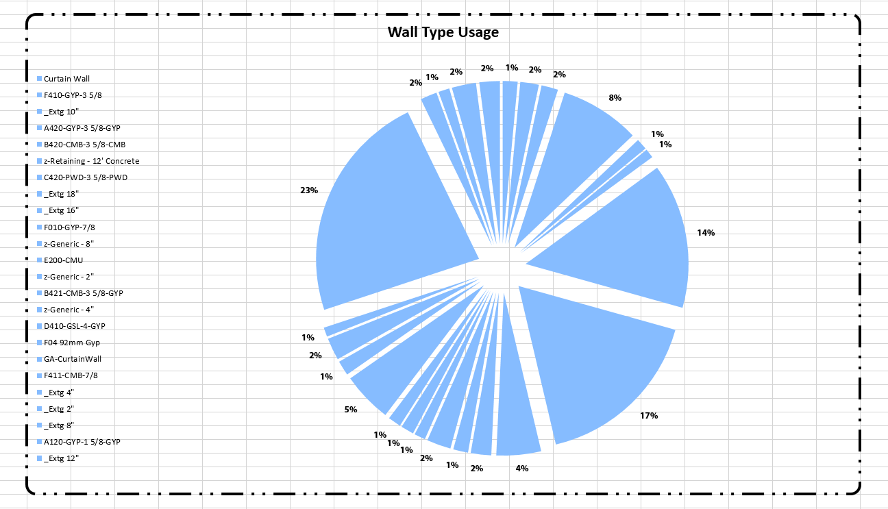

### 2.7.0 Define Chart Style

<blockquote>

<b> FillStyle:</b> [Fill Style] <a href="http://konradsobon.gitbooks.io/bumblebee-primer/content/210_fill_style.html" target="_parent">See Fill Style section for more details.</a>

<b> TextStyle:</b> [Text Style] <a href="http://konradsobon.gitbooks.io/bumblebee-primer/content/220_text_style.html" target="_self">See Text Style section for more details.</a>

<b> BorderStyle:</b> [Border Style] <a href="http://konradsobon.gitbooks.io/bumblebee-primer/content/230_border_style.html" target="_self">See Border Style section for more details.</a>

<b> RoundedCorners:</b> [Boolean] If this input is set to True AND Border Style is supplied it will make the border around chart have rounded corners.

</blockquote>

#### 2.7.1 Example of pie chart with Border and RoundedCorners defined:

