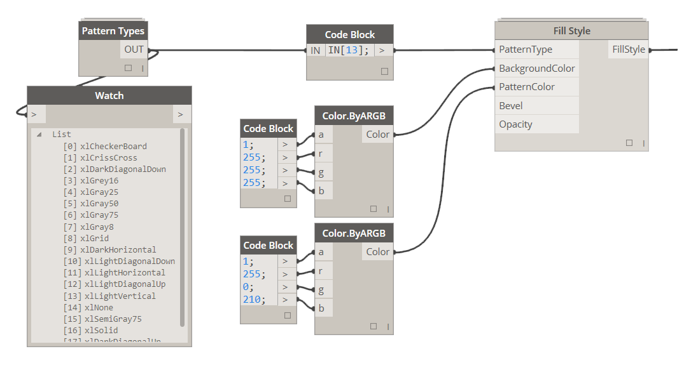

# 3.0.0 Graphic Styles

### 4.2.2 Define Graphic Style

Please see section 3.0.0 for detail instructions on how to define Graphic Styles.

While defining Graphic Style you can chose to either override one or all of the available styles. If you wish to not override Border Style then just leave that input empty.

<blockquote>

<b> FillStyle:</b> [Fill Style] If you supply a fill style to this input it will be overriden to whatever fill style settings were defined for that fill style.

<b> TextStyle:</b> [Text Style] If you supply a text style to this input it will be overridden to whatever text style settings were defined for that text style.

<b> BorderStyle:</b> [Border Style] If you supply a border style to this input it will be overridden to whatever border style settings were defined for that text style.

</blockquote>

### 4.2.3 Define Fill Style

<blockquote>

<b> PatternType:</b> [Pattern Type] If you wish to apply fill pattern to a cell use this input to specify it.

<b> BackgroundColor:</b> [Color] If you wish to specify a background color in a cell use Color.ByARGB node to do so.

<b> PatternColor:</b> [Color] If you wish to specify pattern color use Color.ByARGB node to do so.

<b> Bevel:</b> [Bevel Type] Currently unavailable 

<b> Opacity:</b> [Integer] Currently unavailable 

</blockquote>

&nbsp;
<blockquote>

<b>Tip:</b> When defining Pattern Color one has to specify a background color. Pattern color will only "take" when Background is defined. I usually define background to be White. 
</blockquote>