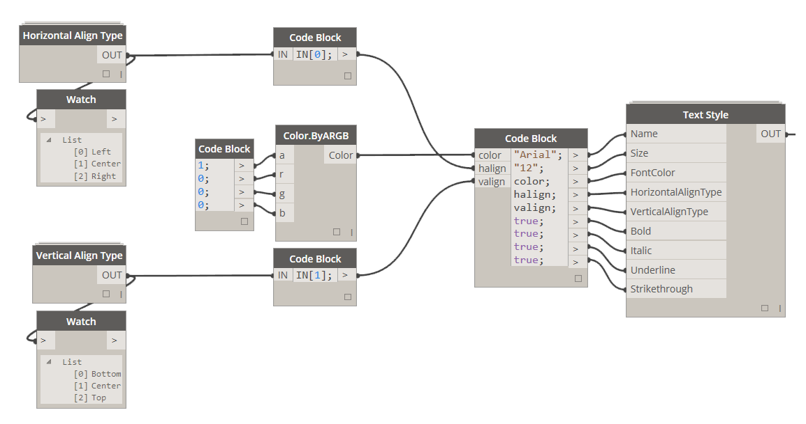

# 2.0.0 Graphic Styles

### 2.0.1 Define Graphic Style

While defining Graphic Style you can chose to either override one or all of the available styles. If you wish to not override Border Style then just leave that input empty.

<blockquote>

<b> FillStyle:</b> [Fill Style] If you supply a fill style to this input it will be overriden to whatever fill style settings were defined for that fill style.

<b> TextStyle:</b> [Text Style] If you supply a text style to this input it will be overridden to whatever text style settings were defined for that text style.

<b> BorderStyle:</b> [Border Style] If you supply a border style to this input it will be overridden to whatever border style settings were defined for that text style.

</blockquote>

### 2.0.2 Define Fill Style

<blockquote>

<b> PatternType:</b> [Pattern Type] If you wish to apply fill pattern to a cell use this input to specify it.

<b> BackgroundColor:</b> [Color] If you wish to specify a background color in a cell use Color.ByARGB node to do so.

<b> PatternColor:</b> [Color] If you wish to specify pattern color use Color.ByARGB node to do so.

<b> Bevel:</b> [Bevel Type] Currently unavailable 

<b> Opacity:</b> [Integer] Currently unavailable 

</blockquote>

&nbsp;
<blockquote>

<b>Tip:</b> When defining Pattern Color one has to specify a background color. Pattern color will only "take" when Background is defined. I usually define background to be White. 
</blockquote>

### 2.0.3 Define Text Style

<blockquote>

<b> Name:</b> [String] This input has to be a name of a font that is currently installed on your machine.

<b> Size:</b> [String] Please specify a size of font to be used as a String. For example: "12" and NOT 12 which would be an integer.

<b> FontColor:</b> [Color] If you wish to specify different than black font color use Color.ByARGB node to do so.

<b> HorizontalAlignType:</b> [Horizontal Align Type] This can be set to Left, Center or Right. 

<b> VerticalAlignType:</b> [Vertical Align Type] This can be set to Top, Middle or Bottom. 

<b> Bold:</b> [Boolean] Set it to True for font to be bold. 

<b> Italic:</b> [Boolean] Set it to True for font to be italic.

<b> Underline:</b> [Boolean] Set it to True for font to have an underline.

<b> Strikethrough:</b> [Boolean] Set it to True for font to have a strikethrough.

</blockquote>

### 2.0.4 Define Border Style

<blockquote>

<b> LineType:</b> [Line Type] If you wish to define a line type different than a solid use this input to do so.

<b> LineWeightType:</b> [Line Weight Type] Line weights can only be one of the following types: Hairline, Medium, Thick or Think.

<b> LineColor:</b> [Color] If you wish to specify line color use Color.ByARGB node to do so.

</blockquote>