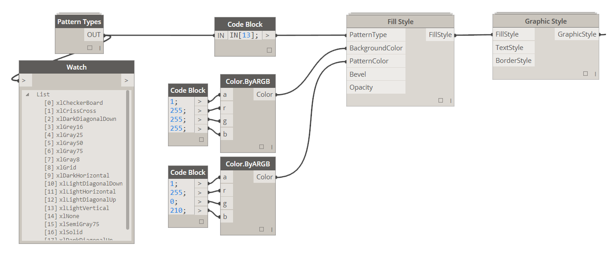

# 4.2.0 Cell Value Formatting

Cell Value Formatting allows you to set up a formatting condition that relies on a value that is contained within each cell that formatting is applied to. This basically allows you to compare each cell to some value and based on some simple comparison operators like "equals" or "less than" you can apply certain style to cell based on that comparison result. 

### 4.2.1 Choose Operator Type and Values

Based on what Operator Type you chose, you will either have to supply one or more values that each cell will be evaluated against. Operator Types available are pretty straight forward and are mostly similar to some of the logical operators that you have already seen in Excel: 

<blockquote>

 1. Equal - requires (1) value for comparison. 

 2. NotEqual - requires (1) value for comparison. 

 3. Greater - requires (1) value for comparison. 

 4. GreaterEqual - requires (1) value for comparison. 

 5. Less - requires (1) value for comparison. 

 6. LessEqual - requires (1) value for comparison. 

 7. Between - requires (2) values for comparison. 

 8. NotBetween - requires (2) values for comparison. 

</blockquote>

Values can be either Strings or Numbers and it simply depends on what data you want to compare it to in Excel. For this example I will use a String. My objective is to check a range of values in Excel and determine if its equal to "Author". If it is then I want to apply a specific Graphic Style to that cell. 

You can either use a Code Block or a String Node like so:

Once we have our condition defined we can move on to defining Graphic Style that will be applied to cells that evaluate to True for the given condition. 

### 4.2.2 Define Graphic Style

<blockquote>

<b> FillStyle:</b> [Fill Style] If you supply a fill style to this input it will be overriden to whatever fill style settings were defined for that fill style.

<b> TextStyle:</b> [Text Style] If you supply a text style to this input it will be overriden to whatever text style settings were defined for that text style.

<b> BorderStyle:</b> [Border Style] If you supply a border style to this input it will be overriden to whatever border style settings were defined for that text style.

</blockquote>

