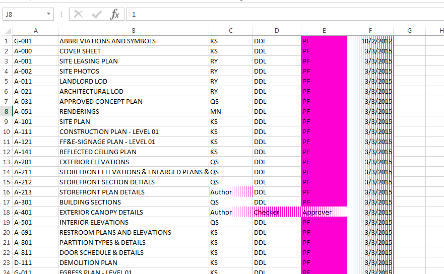

# 4.1.0 Conditional Formatting Overview

Conditional Formatting in Excel can be a really powerful tool. If you ever wanted to use Excel as a model checking or model management tool on Revit projects then this will come really handy for you. I use it to extract all kinds of data and parameters and then apply conditional formatting to it, to quickly identify mistakes and imissions. Conditional Formatting requires 4 main steps to be defined. Here they are:

<blockquote>

1. Choose Conditional Formatting Condition. This can be a Cell Value, Expression or 2/3 Color Gradient Scheme. 

2. Define rules that will govern whether Graphic Style will be applied to a cell or not. 

3. Create a Graphic Style that will be applied to a cell in case that cell evaluates to True based on formatting rule. 

4. Apply it to Excel Document/Range.
</blockquote>

Let's go over these four steps using Cell Value Formatting Condition as an example. 

### 4.1.1 Set Up

<blockquote>

<b> FilePath:</b> [FilePath] Use this input to specify excel file that formatting will be applied to. 

<b> RunIt:</b> [Boolean] Set this input to True to enable this node and execute it. Set it to False to disable it. 

<b> SheetName:</b> [String] Use this input to specify what sheet you want to apply the formatting to. 

<b> CellRange:</b> [String or List[String]] Use this node to define a specific range that you want the formatting to be applied to. Typical Excel syntax applies where range is defined like so: "A1:B1". 

<b> FormatConditions:</b> [FormatCondition or List[FormatCondition]] Use this input to supply a single Format Condition object (for example a Cell Value FC) or a list of multiple Format Conditions. This allows you to combine multiple Cell Value format conditions or apply them to multiple ranges. 
</blockquote>

### 4.1.2 Example:

Multiple Formatting Conditions applied to multiple ranges in an Excel file helping me identify parameters in my Drawing List that were not set or set incorrectly. 

Rules Box in Excel that reflects all of the Conditions applied. 

