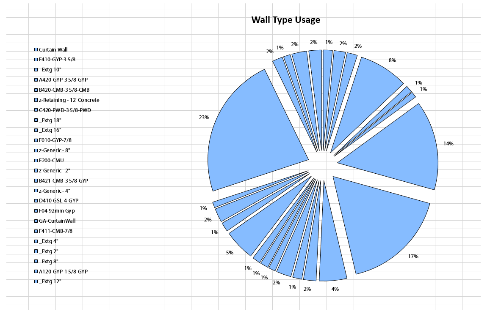

# 4.1.0 Pie Chart

Pie Charts are some of the most useful and easy to understand charts available to us in Excel. They are also one of the simpler charts that you can generate using Excel. That's because they can really display a single range of data at a time. Even though you can use them to generate data for 2D Arrays of data, you can only show one of them at a time, so its kind of limited. Keep that in mind when dealing with charts.

### 4.1.1 Defining Pie Chart Inputs

<blockquote>

<b>RunIt:</b> [Boolean] Set this input to True to enable this node.

<b>SheetName:</b> [String] Name of the Excel Worksheet that you want to place/update the chart on.

<b>SizeRange:</b> [String] 
 Use this input to define a range in Excel that chart will be scaled to fit. Typical Excel syntax applies where range is defined like so: "A1:D11".

<b>Title:</b> [String]  This will be the text in the title on top of the chart.

<b>DataRange:</b> [String] Use this input to define a range in Excel that chart will get its data source from. Charts can only be applied to numbers so keep that in mind.

<b>PieChartType:</b> [Pie Chart Type] This can be one of the available outputs from Pie Chart Types node.

<b>LegendStyle:</b> [Legend Style] Use this input to specify Legend formatting options.

<b>ChartStyle:</b> [Chart Style]  Use this input to specify Chart formatting options.

<b>GraphStyle:</b> [Graph Style]  Use this input to specify Graph formatting options.

</blockquote>

### 4.1.2 Defining Pie Chart Inputs