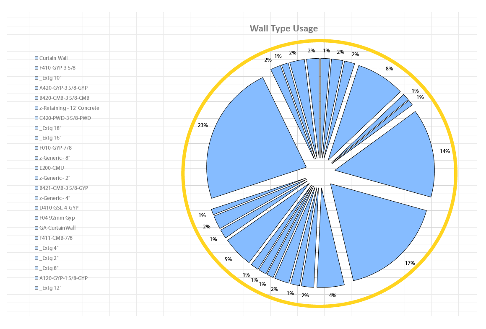

# 4.1.0 Pie Chart

Pie Charts are some of the most useful and easy to understand charts available to us in Excel. They are also one of the simpler charts that you can generate using Excel. That's because they can really display a single range of data at a time. Even though you can use them to generate data for 2D Arrays, you can only show one of them at a time, so its kind of limited. Keep that in mind when dealing with charts.

### 4.1.1 Defining Pie Chart Inputs

<blockquote>

<b>RunIt:</b> [Boolean] Set this input to True to enable this node.

<b>SheetName:</b> [String] Name of the Excel Worksheet that you want to place/update the chart on.

<b>SizeRange:</b> [String] 
 Use this input to define a range in Excel that chart will be scaled to fit. Typical Excel syntax applies where range is defined like so: "A1:D11".

<b>Title:</b> [String]  This will be the text in the title on top of the chart.

<b>DataRange:</b> [String] Use this input to define a range in Excel that chart will get its data source from. Charts can only be applied to numbers so keep that in mind.

<b>PieChartType:</b> [Pie Chart Type] This can be one of the available outputs from Pie Chart Types node.

<b>LegendStyle:</b> [Legend Style] Use this input to specify Legend formatting options.

<b>ChartStyle:</b> [Chart Style]  Use this input to specify Chart formatting options.

<b>GraphStyle:</b> [Graph Style]  Use this input to specify Graph formatting options.

</blockquote>

### 4.1.2 Defining Pie Chart Styling Options

Pie Charts have a handful of parts that can be individually formatted with some unique aesthetics. I am not a huge fan of doing too much when it comes to aesthetics but there are a few things that I like and I will outline them below.

#### 4.1.3 Legend Styling

First and foremost, if you DO NOT supply a Legend Style to Pie Chart node, it will result in a chart without a legend. 

If you however, decided that legend is what you want, you have a few options here. I personally like to adjust Text Style to make sure that the fond is exactly what I like. Then you can pick a Legend Position, and there are basically (4) options to choose from: Left, Top, Right and Bottom. If you do not specify any of these inputs they will be assigned automatically by Excel. Last thing that I define here is Legend Labels. By default they will be just a series of numbers, but you can use a Range to define custom names for each legend item. 

Of course you can also add Fill and Border Styles to create this god awful look with a little frame around your legend. Feel free to do that as well if your heart desires so. 

#### 4.1.4 Graph and Label Styling

Again, if you decide NOT TO supply a Graph Style input into a Pie Chart a default setting will be applied. That means you will be seeing a very colorful, non-exploded and labeless chart. 

In case that you do, want to supply a Graph Style it actually consists of two parts. First part is controlling the Graph itself and second is controlling the labels that you see around the Graph. For the second part we will be using a node called Label Style. 

First thing that I like to do, is input an integer into Explosion input of Graph Style. That will control how much the each pie pieces fly apart. Keep in mind that the bigger the number the smaller the pie chart pieces, because no matter what, it will not go beyond the specified size. I also like to add a delicate border around each slice - use Border Style node to specify that. Finally, I add a Fill Style to make all of the colors in my chart the same. :-) I know, this kind of defeats the purpose of making a chart in a first place - but hey, its my chart so I can do whatever I like. 

I also, do some Label Styling. You can use the Label Style node to control what shows up in the labels and where exactly they are created. I set the Text Style for my labels. I then set labels to display a percentage that each slice is in relation to the whole data set.  Finally I use the Label Position Types node to place each node on the Outside End of the chart. 

#### 4.1.5 Chart Styling

This time the default setting is a white background and a solid border around the whole chart. If you however, supply an empty Chart Style, that in-itself will make the background become transparent and will remove the border. For the sake of illustration I have added a dashed border around the chart area, just so its clear what we are actually dealing with here. 

My personal preference here is to just plug an empty Chart Style node into the Pie Chart node and move on, but for this illustration I have added a little border styling with Rounded Corners and dashed style. 

