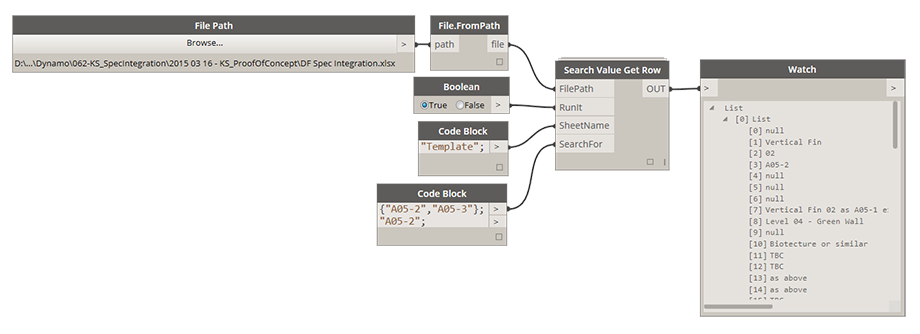

# 4.1.0 Search Value Get Row

This node allows you to search for a single value (string) and it will return an entire row of data that this key value was found in. For example you searched for a string "A500" and it was found at cell address A15, this node will return all data that was contained in row 15. 

### 4.1.1 Set Up

<blockquote>

<b>FilePath:</b> [FilePath>File.FromPath] This input requires two nodes File Path and File.FromPath arranged in a sequence. If file specified doesn't exist yet it will cause an error. 

<b>RunIt: </b> [Boolean] Toggle it to True to execute the node. Toggle it to False to disable the node. 

<b>SheetName:</b> [String] This is the Name of the Sheet in Excel file that will be read from. 

<b>SearchFor: </b>[String or List[String]] If single string is supplied then it will return a flat list of data from a single row. If List of Strings is supplied it will return a Nested List of Data for each search key. 

</blockquote>
