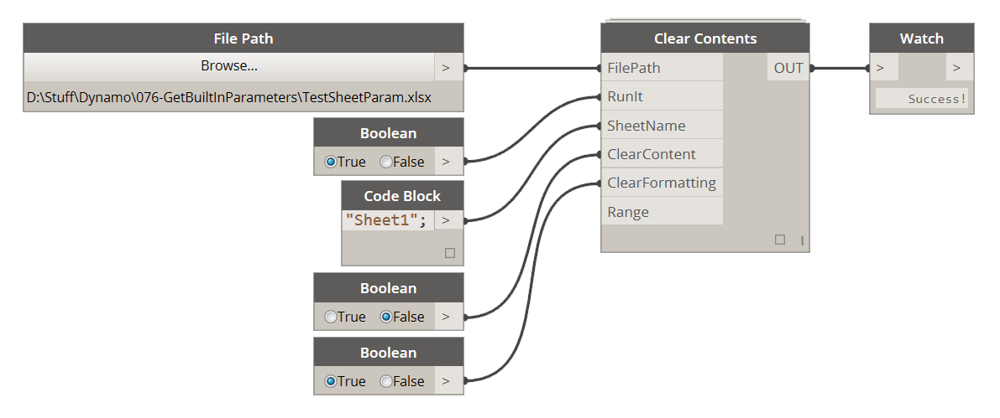

# 4.2.0 Clear Contents

Clear Contents is a node that will allow you to do few things. One of them is to clear data or cell content from a range of Excel sheet. It can also clear any formatting applied to those cells (color fills, text style overrides etc.). 

### 4.2.1 Set up