# 4.2.0 Cell Value Formatting

Cell Value Formatting allows you to set up a formatting condition that relies on a value that is contained within each cell that formatting is applied to. This basically allows you to compare each cell to some value and based on some simple comparison operators like "equals" or "less than" you can apply certain style to cell based on that comparison result. 

### 4.2.1 Choose Operator Type and Values

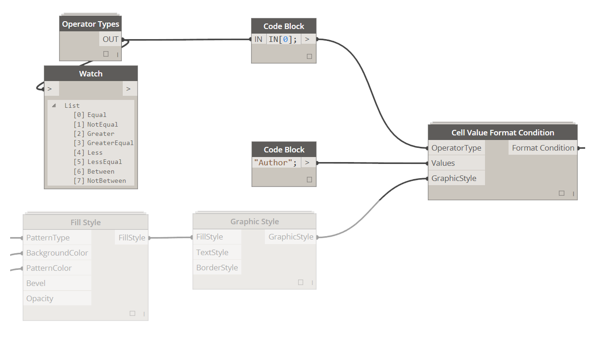

Based on what Operator Type you chose, you will either have to supply one or more values that each cell will be evaluated against. Operator Types available are pretty straight forward and are mostly similar to some of the logical operators that you have already seen in Excel: 

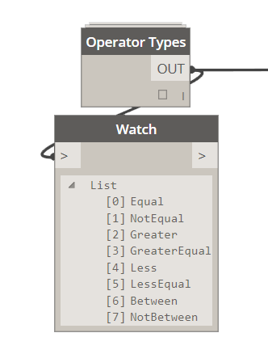

<blockquote>

 1. Equal - requires (1) value for comparison. 

 2. NotEqual - requires (1) value for comparison. 

 3. Greater - requires (1) value for comparison. 

 4. GreaterEqual - requires (1) value for comparison. 

 5. Less - requires (1) value for comparison. 

 6. LessEqual - requires (1) value for comparison. 

 7. Between - requires (2) values for comparison. 

 8. NotBetween - requires (2) values for comparison. 

</blockquote>

Values can be either Strings or Numbers and it simply depends on what data you want to compare it to in Excel. For this example I will use a String. My objective is to check a range of values in Excel and determine if its equal to "Author". If it is then I want to apply a specific Graphic Style to that cell. 

You can either use a Code Block or a String Node like so:

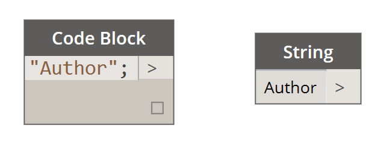

Once we have our condition defined we can move on to defining Graphic Style that will be applied to cells that evaluate to True for the given condition. 

### 4.2.2 Define Graphic Style

Please see section 3.0.0 for detail instructions on how to define Graphic Styles.

### 4.2.4 Define Text Style

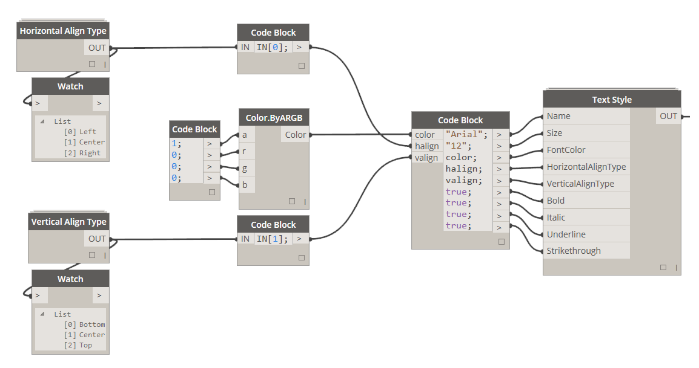

<blockquote>

<b> Name:</b> [String] This input has to be a name of a font that is currently installed on your machine.

<b> Size:</b> [String] Please specify a size of font to be used as a String. For example: "12" and NOT 12 which would be an integer.

<b> FontColor:</b> [Color] If you wish to specify different than black font color use Color.ByARGB node to do so.

<b> HorizontalAlignType:</b> [Horizontal Align Type] This can be set to Left, Center or Right. 

<b> VerticalAlignType:</b> [Vertical Align Type] This can be set to Top, Middle or Bottom. 

<b> Bold:</b> [Boolean] Set it to True for font to be bold. 

<b> Italic:</b> [Boolean] Set it to True for font to be italic.

<b> Underline:</b> [Boolean] Set it to True for font to have an underline.

<b> Strikethrough:</b> [Boolean] Set it to True for font to have a strikethrough.

</blockquote>

### 4.2.5 Define Border Style

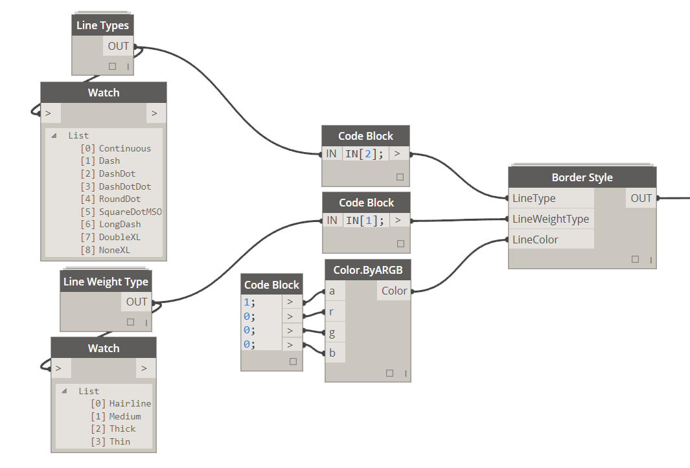

<blockquote>

<b> LineType:</b> [Line Type] If you wish to define a line type different than a solid use this input to do so.

<b> LineWeightType:</b> [Line Weight Type] Line weights can only be one of the following types: Hairline, Medium, Thick or Think.

<b> LineColor:</b> [Color] If you wish to specify line color use Color.ByARGB node to do so.

</blockquote>

### 4.2.6 Cell Value Format Condition - Single Range/Single Format Condition

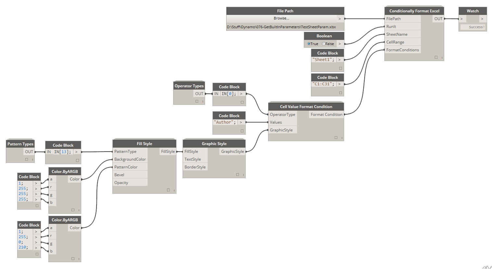

This is what the final result will look like:

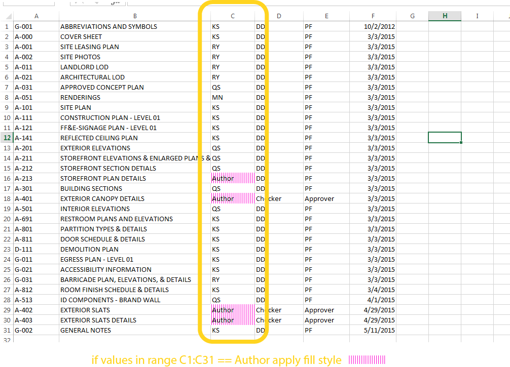

### 4.2.7 Cell Value Format Condition - Single Range/Multiple Format Conditions

You can also stack more than one Format Condition on top of each other and formatting will be applied based on order that they were added in case that both Format Conditions evaluate to True. Here's an example:

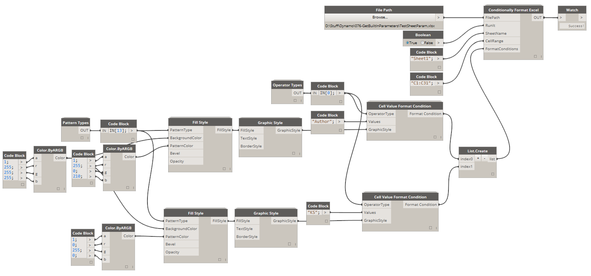

This is what the final result will look like:

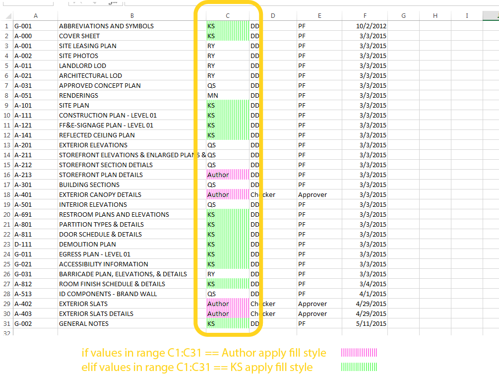

### 4.2.8 Cell Value Format Condition - Multiple Ranges/Multiple Format Conditions

You can also apply different Format Conditions to more than one range at the time while maintaining ability to add more than one Format Condition per Range. Just create lists of lists of Format Conditions and you will be good to go. 

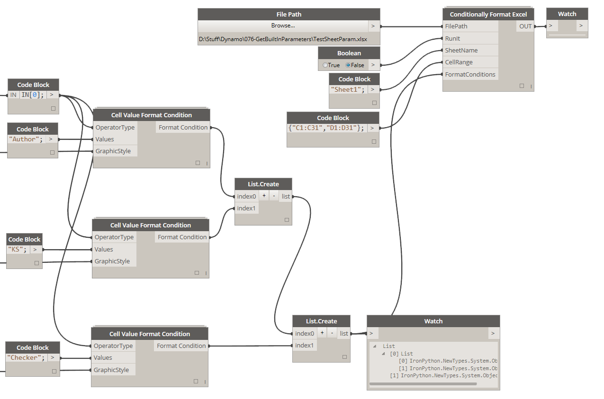

This is what the final result will look like:

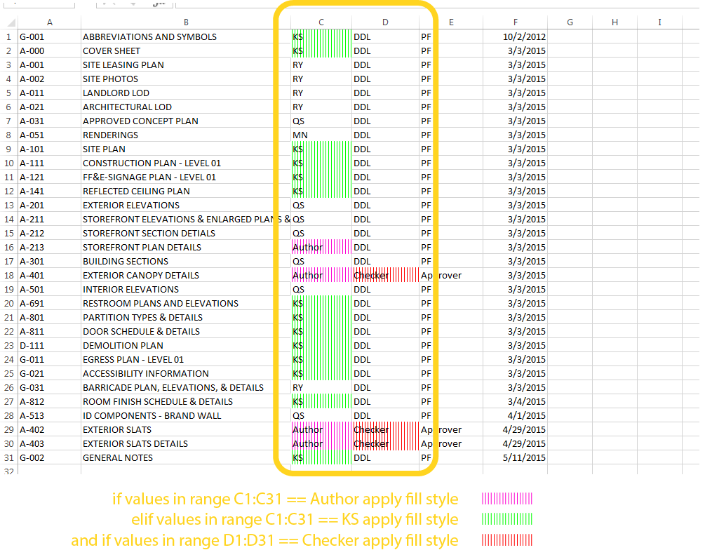

The trick is to match the length of the Cell Range list with the Format Conditions list like so: 

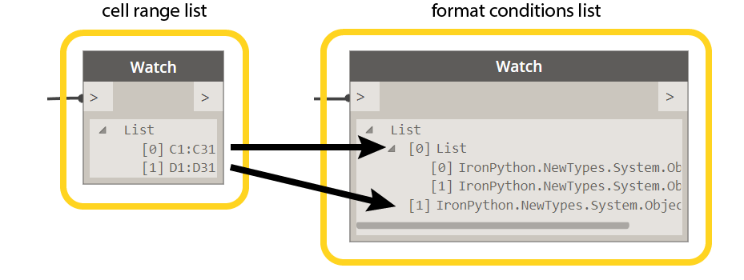
