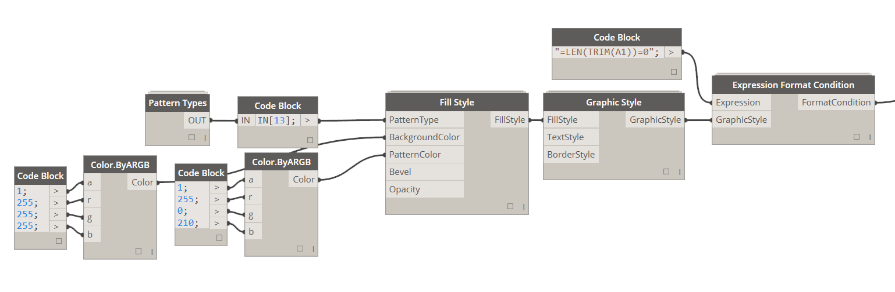

# 4.3.0 Expression Formatting

Expression Formatting allows you to set up a formatting condition that will evaluate an Excel expression as if it was applied to every cell and apply certain style to cell based on that evaluation result. 

### 4.3.1 Define an Expression

This is Excel based expression written out as if you were typing it into Excel's formula bar. All Excel formatting/syntax applies here as well. I am not an Excel formulas guru but here is a simple one that evaluates whether a cell is empty simply by measuring length of string contained within it. If there is no string, this expression will evaluate to True:

#### # *"=LEN(TRIM(C1))=0"*

<blockquote>

<b>Tip:</b> Keep in mind that cell that is being used for evaluation here (C1) needs to be within the range that this expression formatting is being applied to (C1:C31). If my range was A1:A31 then my expression would have to be "=LEN(TRIM(A1))=0". 

</blockquote>

Again I am not an excel guru, but this rule holds true even when you try applying conditional formatting using Excel's user interface. As a matter of fact this is the best way to test something - try it in Excel first. 

### 4.3.2 Define Graphic Style

Please see Define Graphic Style section of this book for more details on how to define Graphic Style. 

This is what the final result would look like:

### 4.3.3 Putting it together...

Exactly the same rules apply to Expression Formatting as to Cell Value Formatting. You can stack multiple format conditions on top of each other or apply them to different ranges at the same time. Please see section 4.1.0 Cell Value Formatting to see multiple condition formats in action. Here's an example of stacking Cell Value Format Condition and Expression Condition in the same Range. 

