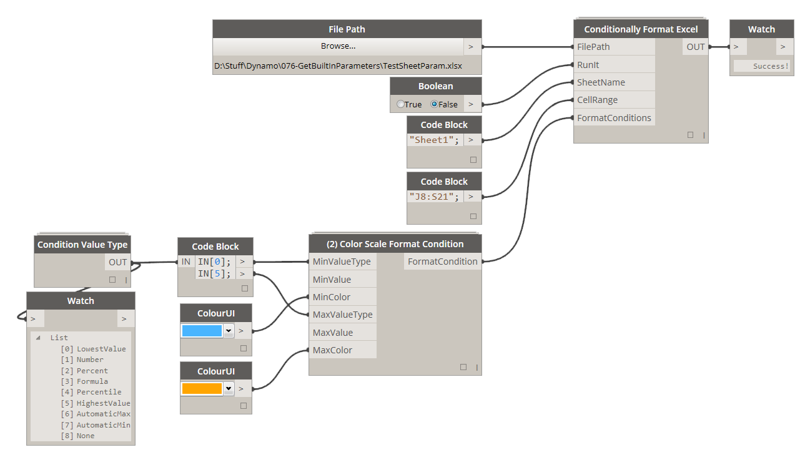

# 4.4.0 (2) Color Scale Formatting

(2) Color Scale Formatting allows you to set up a formatting condition that will evaluate a range of numbers and then based on some simple rules will color all of the values with an appropriate color defined in a two color gradient.

