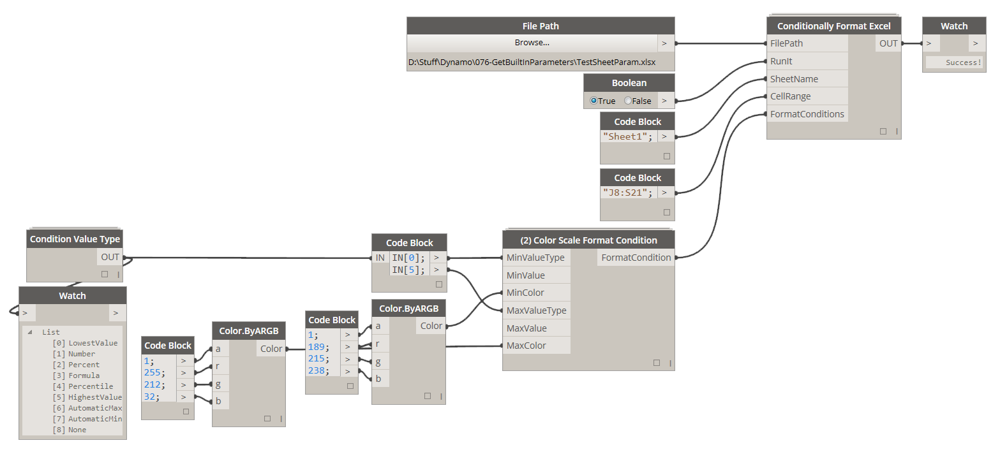
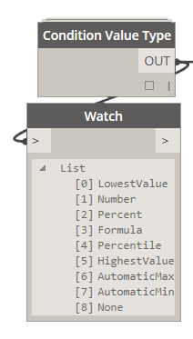
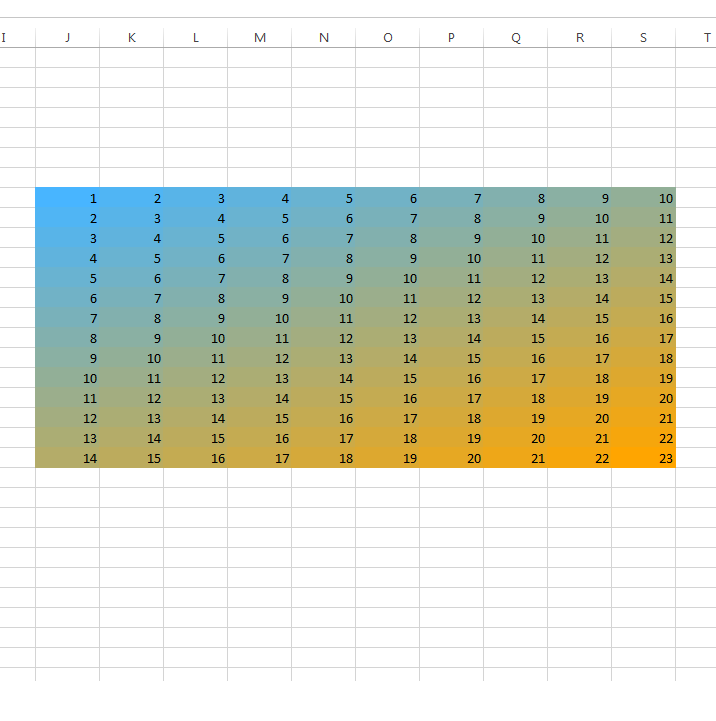
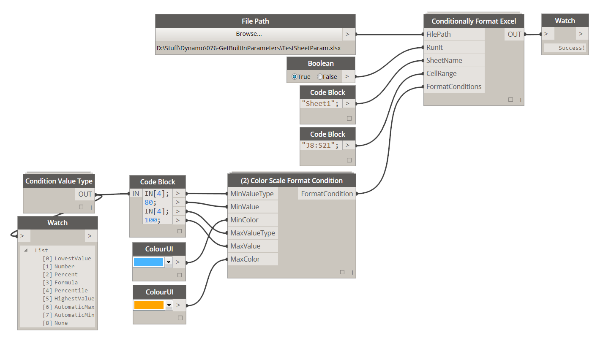
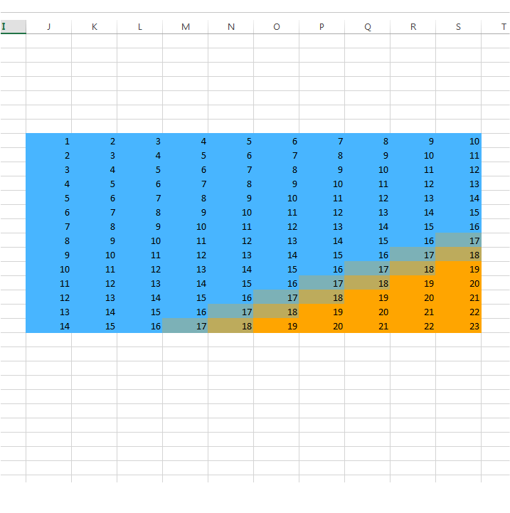

# 4.5.0 (3) Color Scale Formatting

(3) Color Scale Formatting allows you to set up a formatting condition that will evaluate a range of numbers and then based on some simple rules will color all of the values with an appropriate color defined in a two color gradient.

### 4.4.1 Define Min and Max Value Types

You can define rules of how this color gradient will be applied to range of numbers by specifying Min and Max value types. This can either be as simple as "automatic" or as custom as inputting an actual number for a min/max value. 

Let's have a quick look at available options and their meaning. 

<blockquote>

<b> LowestValue:</b> If you chose this option, Excel will automatically chose the lowest value in the specified range and use that as a Minimum. Choosing this option means that you DO NOT have to supply MinValue. LowestValue can ONLY be applied to MinValueType input.

<b> Number: </b> If you chose this option, you will have to also supply MinValue/MaxValue input that will determine the minimum number. 

<b>Percent:</b> If you chose this option you will have to supply MinValue/MaxValue and it will have to be between 0-100. 

<b> Formula: </b> You can use a Formula to determine a MinValue/MaxValue. If you chose to use the formula then, you have to supply it to MinValue/MaxValue input. Something to keep in mind when using Formulas with 2-Color Formatting is that they cannot be referencing other cells. That means that a formula like this: =1, will work just fine while something like this: =$B1=1, will not.

<b> Percentile:</b> If you chose this option you will have to supply MinValue/MaxValue and it will have to be between 1-99. 
 

<b> HighestValue:</b> If you chose this option, Excel will automatically choose the highest value in the specified range and use that as a Maximum. Choosing this option means that you DO NOT have to supply MaxValue. HighestValue can ONLY be applied to MaxValueType input.

<strike><b> AutomaticMax:</b> This option is NOT available for use with (2) Color Scale Formatting. </strike>

<strike><b> AutomaticMin:</b> This option is NOT available for use with (2) Color Scale Formatting. </strike>

<strike><b> None:</b> This option is NOT available for use with (2) Color Scale Formatting.</strike> 

</blockquote>

### 4.4.2 Define Min and Max Values

Based on chosen Min/Max Values Types you might have to specify a numerical or formula value that will be used with this formatting style. Here's what the example above will look like:

Here's an additional example that will color only top 20% of the specified range with orange color while applying a blue color to lower 80%. 

Here's what this set up will evaluate to: 

