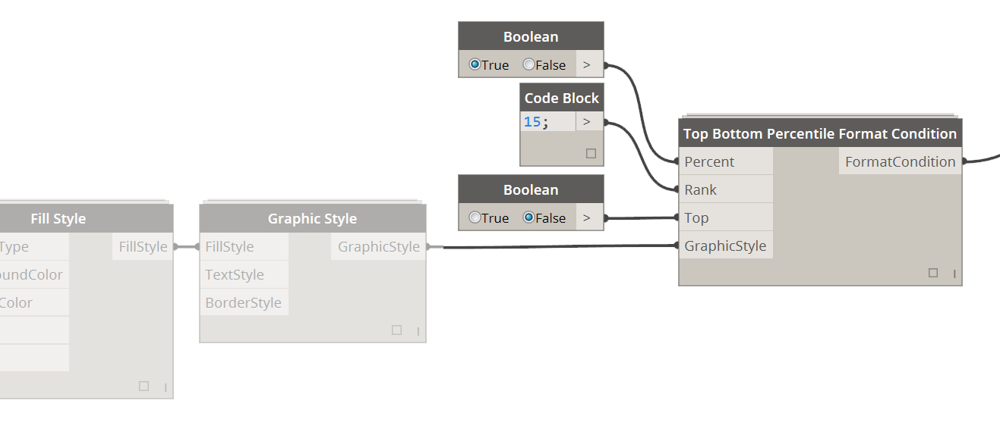
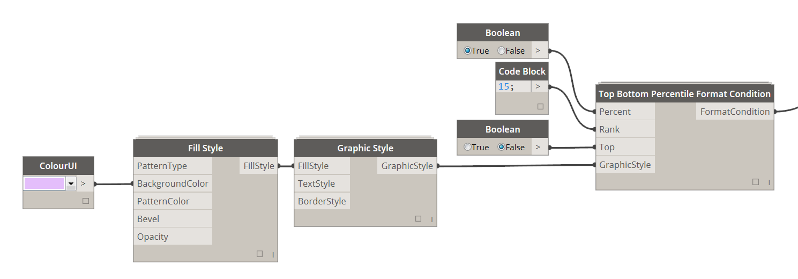
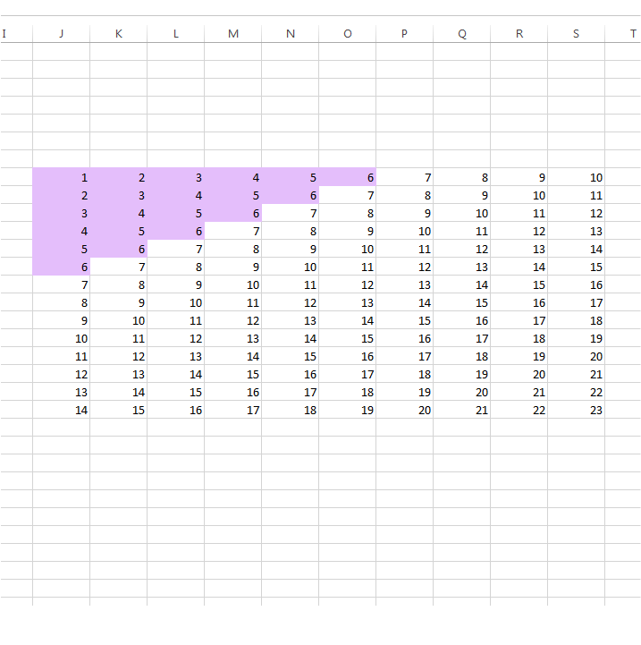
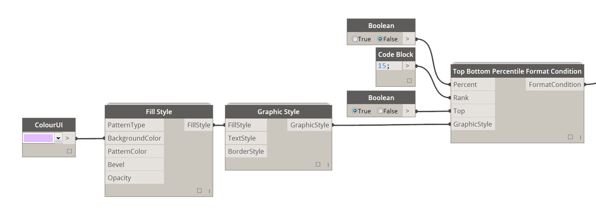
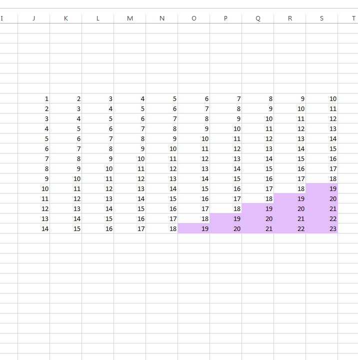

# 4.6.0 Top/Bottom Percentile Formatting

Top/Bottom Percentile Formatting allows you to set up a formatting condition that will either highlight a top or bottom percentile of values in a given range, or it will highlight a number of top or bottom values. 

### 4.6.1 Define Formatting Condition rules

<blockquote>

<b>Percent:</b> [Boolean] If Boolean set to True this formatting condition will use a top/bottom percentage of values in the supplied range. If Boolean set to False it will take a number of top/bottom values according to Integer value specified in Rank input.

<b>Rank:</b> [Integer] If Percent input is True then this will determine the percentage of values while if Percent is False this will be a number of top/bottom values. 

<b>Top:</b> [Boolean] If set to True it will highlight Top values while if set to False it will highlight Bottom values.

<b>GraphicStyle:</b> [Graphic Style] This Graphic Style will be applied to all values that fall within specified range of top/bottom performers in a given range.

</blockquote>

### 4.6.2 Define Graphic Style

Please see section 3.0.0 for detail instructions on how to define Graphic Styles. This Graphic Style will be used if cell evaluates to True based on rules defined in previous section. 

### 4.6.3 Top Percentile Values

In this example we highlight Bottom 15% of all numbers in the specified range.

### 4.6.4 Top Number of Values 

