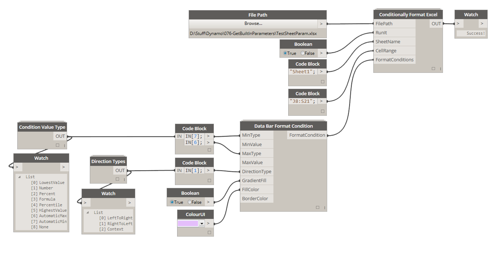
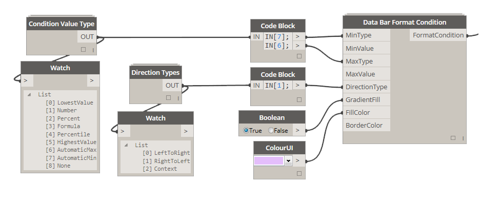
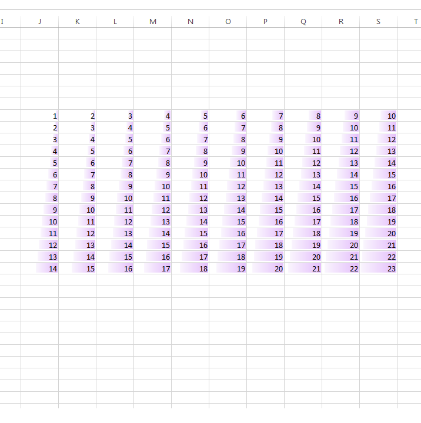
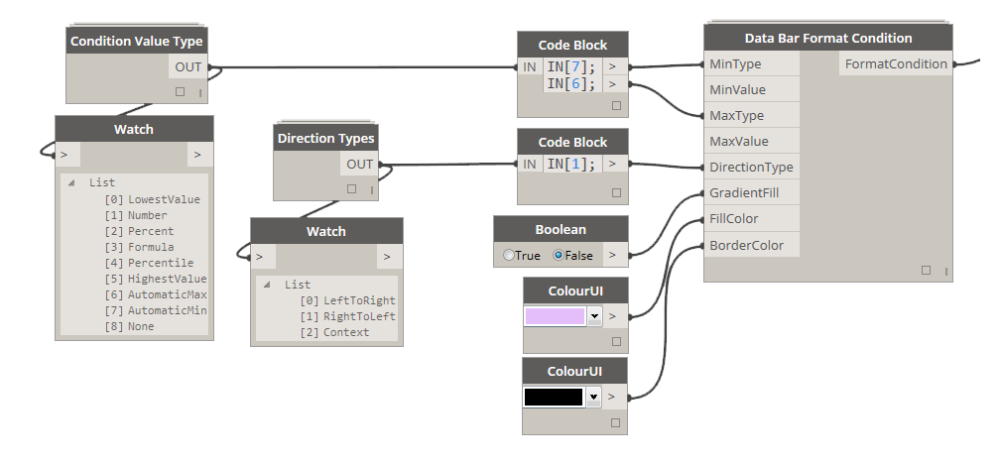
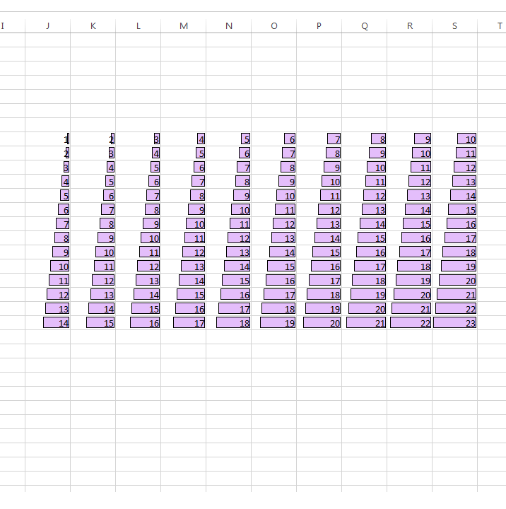

# 3.7.0 Data Bar Formatting

Top/Bottom Percentile Formatting allows you to set up a formatting condition that will either highlight a top or bottom percentile of values in a given range, or it will highlight a number of top or bottom values. 

### 3.7.1 Define Formatting Condition Rules

<blockquote>

<b>MinType:</b> [Condition Value Type] If this input is LowestValue or AutomaticMin Excel will automatically assign the minimum value from the range of numbers specified. MinValue will NOT need to be supplied if either one of the two values are used.

<b>MinValue:</b> [Integer]  Only needed if MinType IS NOT LowestValue or AutomaticMin 

<b>MaxType:</b> [[Condition Value Type] If this input is HeighestValue or AutomaticMax Excel will automatically assign the maximum value from the range of numbers specified. MaxValue will NOT need to be supplied if either one of the two values are used.

<b>MaxValue:</b> [Integer] Only needed if MaxType IS NOT HeighestValue or AutomaticMax 

<b>DirectionType:</b> [Direction Type] Use this input to specify direction of the data bar. 

<b>GradientFill:</b> [Boolean] If set to True, generated data bar will have a gradient fill style fading from FillColor specified to White. 

<b>FillColor:</b> [Color] Color of the Data Bar

<b>BorderColor:</b> [Color] If supplied, it will set the border color for each cell in the specified range. 

</blockquote>

### 3.6.2 Data Bar with Gradient no Border

In this example we highlight cells in the specified range using a gradient data bar that has no border. It also has automatic min and max values assigned that were generated based on the values in the supplied range. 

### 3.6.3 Data Bar with Border and no Gradient

In this example we highlight cells in the specified range using a data bar that has a border. It also has automatic min and max values assigned that were generated based on the values in the supplied range. 

