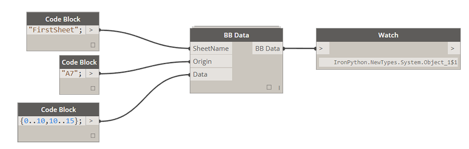

# 1.3.0 Write Data to Excel in Live Mode

Given large community outcry (yes, I am looking at you - Shane Burger) I decided to include this node in Bumblebee. It will allow you to stream data to Excel while Excel is open and results will display/update in Excel instantly - or as fast as it takes Excel to refresh. 

#### One rule here is to have ONLY the document that you intend to override open, since this node will write to first Excel file that it encounters in the ROT (Running Objects Table). 

### 1.3.1 Write Multiple Rows of Data to Excel

This is probably the most common application for Bumblebee - writing a nested list of data to multiple columns or rows to an Excel spreadsheet. Here's how its done: 

<blockquote>

<b>RunIt:</b> [Boolean] If set to False it will disable this node. If set to True it will enable this node and execute the write process.

<b>ByColumn:</b> [Boolean] If set to False this file will be written "By Row" which is a standard Excel writing method. Setting it to True will be equivelant to performing a Transpose function on data before writing it.

<b>BBData:</b> [BBData] This is a BBData input. Please see below for how this node can be set up.

</blockquote>

### 1.3.2 Setting Up BB Data Node

For any of the inputs please make sure that you always match their data types. What I mean by that is if you define SheetName to be a list of two items: ["Sheet1","Sheet2"] then make sure that Origin is also a matching list: ["A1","A1"] and Data is a Nested List of Lists: [[[1,2],[1,2]],[[2,2],[2,2]]]. 

<blockquote>

<b>SheetName:</b> [String or List[String]] If Sheet Name is a single item, Origin and Data input have to match that. This is a Sheet that Data will be written into. If sheet with specified name doesn't exist a new sheet with that name will be added to specified Excel document.

<b>Origin:</b> [String or List[String]] This is origin cell that data writing will start at. By default this input is specified at A1 but it can be changed to begin writing from any other location.

<b>Data:</b> [List[] or Nested List[[]]] This is data that you wish to write to Excel. For now Bumblebee was only tested writing Numbers and Strings. 

</blockquote>

